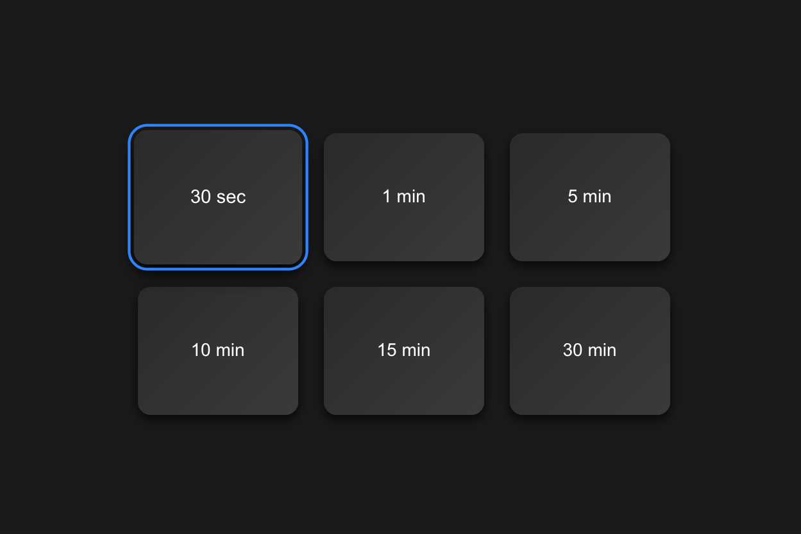

# TvTimer



A simple and convenient timer application designed for TV screens. Allows users to select a preset time interval, start a countdown, pause, reset, and return to the main screen easily.

## 📱 Available on LG Content Store

[](https://ru.lgappstv.com/main/tvapp/detail?appId=1268337&catCode1=004&moreYn=N&cateYn=Y&orderType=2&headerName=%D0%9F%D0%BE%D0%BB%D0%B5%D0%B7%D0%BD%D1%8B%D0%B5&appRankCode=&sellrUsrNo=&curPage=1)

## ✨ Features

- **TV-Optimized Interface**: Designed specifically for large TV screens
- **Preset Timer Options**: Quick selection of common time intervals (30 sec, 1 min, 5 min, 10 min, 15 min, 30 min)
- **Easy Navigation**: Simple controls for play, pause, reset, and return to home
- **Visual Countdown**: Clear display of remaining time
- **Remote Control Support**: Fully navigable with TV remote control

## 🛠️ Technology Stack

This project is built with modern web technologies:

- **Vue 3** - Progressive JavaScript framework
- **TypeScript** - Type-safe development
- **Vite** - Fast build tool and development server
- **Pinia** - State management
- **Vue Router** - Client-side routing

## 🚀 Development Setup

### Prerequisites

- Node.js (version 18 or higher)
- npm or yarn

### Installation

```sh
npm install
```

### Development

Start the development server with hot-reload:

```sh
npm run dev
```

### Build for Production

Type-check, compile and minify for production:

```sh
npm run build
```

Preview the production build:

```sh
npm run preview
```

## 🔧 Code Quality

### Linting

Run ESLint with auto-fix:

```sh
npm run lint
```

### Type Checking

Check TypeScript types:

```sh
npm run type-check
```

### Code Formatting

Format code with Prettier:

```sh
npm run format
```

## 📝 Recommended IDE Setup

- [VSCode](https://code.visualstudio.com/) + [Volar](https://marketplace.visualstudio.com/items?itemName=Vue.volar) extension
- Disable Vetur if you have it installed

## 📋 Type Support for Vue Imports

TypeScript cannot handle type information for `.vue` imports by default. We use `vue-tsc` for type checking and recommend the [Volar](https://marketplace.visualstudio.com/items?itemName=Vue.volar) extension for proper TypeScript support in Vue files.

## ⚙️ Configuration

For more configuration options, see the [Vite Configuration Reference](https://vite.dev/config/).

## 📄 License

This project is private and proprietary.

---

Made with ❤️ for TV platforms
